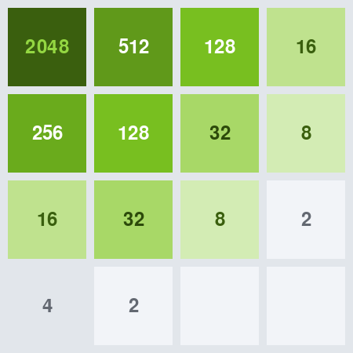

# 2048

Implementation of the popular 2048 game in Python, with an engine built to sit under an
AI search such as Monte Carlo Tree Search — and a browser UI that lets you watch a model
play it.



## Running the game

The project is developed in a dev container, which brings its own Python, [uv], PowerShell
and the GitHub CLI. Open the repository in VS Code and choose **Reopen in Container**;
everything below then works with no further setup.

```bash
uv run py2048           # console user interface
uv run py2048-pygame    # pygame user interface
uv run py2048-web       # browser user interface, on http://127.0.0.1:8000
```

Outside the dev container you need [uv] and Python 3.12. `uv run` syncs the environment
from `uv.lock` before it runs anything, so there is no separate install step and no
virtualenv to activate.

### Controls

The pygame UI uses the arrow keys. **R** starts a new game and **Esc** quits. When no
move is left, the board dims and reports the final score.

The browser UI uses the arrow keys as well, or W A S D, with a button for a new game.
The Python engine stays in charge: the page posts moves and renders the board that comes
back, pushed over server-sent events, so two open tabs stay in step.

The console UI is keyboard driven too, and prints the board as text:

| Key | Action |
|---|---|
| `w` | move UP |
| `s` | move DOWN |
| `a` | move LEFT |
| `d` | move RIGHT |
| `q` | quit |

```
Number of successful moves:58, Last move attempted:UP:, Move status:True
Score:372, Merge count:46, Max tile:32, Max tile coords:(2,1)
-------------------------------------
|   4    |   8    |   4    |   2    |
-------------------------------------
|   32   |   16   |   8    |   4    |
-------------------------------------
|   8    |   2    |   32   |        |
-------------------------------------
|   4    |   16   |        |   2    |
-------------------------------------
```

## Letting an AI play

The browser UI can hand the game to an AI player and let you watch. Pick one from the menu
under the board and press play. There are four.

**Jev** sends the board to [TypeSafe AI's Jev][jev] as JSON, along with what each move
would do — what it scores, how much room it leaves, how many directions remain legal
afterwards, what it does to the order of the tiles, and whether an unlucky spawn could end
the game — all played out on a copy by the engine, so the model judges facts rather than
imagining them. Only the legal directions are offered, and a decision takes around 250ms.
[What exactly it is told, and what is deliberately left out][state-docs], is in the
architecture notes.

Set `TYPESAFE_API_KEY` in `.env` (copy `.env.example`) to use the real model. Without a key
it still plays, using a local fallback policy that is clearly marked on screen — as are API
errors and decisions the model was too unsure to make.

**Monte Carlo Tree Search** needs no key and no network. Given half a second it plays about
seven thousand random games from the current position and plays the move it spent most of
that time on. It is a port of [an MSc assignment][mcts-repo] that reached the 2048 tile in
72% of its final games; [how it works and what was fixed on the way in][mcts-docs] is in
the architecture notes.

**Corner rules** plays the first legal direction on a fixed list — UP, then RIGHT, then
DOWN, then LEFT — so tiles pile into the top-right corner and it only breaks that when the
engine gives it no choice. It is the oldest advice in 2048, and it is what Jev falls back
to when it cannot be asked.

**Random** picks a legal move and nothing more. It is the floor the others are measured
against, and the smallest thing that meets the player contract.

Whichever is playing, the page shows how sure it was and why it moved.

The four share almost nothing: a player is anything that answers
`choose(board, moves_played, recent_moves)` with a direction and a decision, so
[adding a fifth][players-docs] is a module of its own and one line in the register.

## Architecture

One engine, four consumers: a console UI, a pygame UI, a browser UI and the AI players, all
independent users of one `Board` that holds every rule. That split is what lets the engine
be driven by a search algorithm instead of a keyboard — which is exactly what the MCTS
player does.

```
src/py2048/engine.py      Board + Tile. The engine: all game logic.
src/py2048/console.py     Console UI.    Entry point: py2048
src/py2048/pygame_ui.py   Pygame UI.     Entry point: py2048-pygame
src/py2048/web/           Browser UI.    Entry point: py2048-web
src/py2048/agent/         AI players.    Board state in, one direction out
                          jev/ mcts/ rules_player.py random_player.py
```

**[docs/architecture.md](docs/architecture.md)** has the whole picture: the diagrams, the
browser round trip, the JSON the AI player is sent, and the conventions worth knowing
before reading the code.

## Specifications

Behaviour is pinned down by an executable specification suite, written in Gherkin and run
with [behave]:

```bash
uv run behave                            # the whole suite
uv run behave features/movement.feature  # one feature
```

Scenarios show the board before and after a move as a table, so a rule reads the way the
game looks:

```gherkin
  Scenario: Two equal tiles merge when moved left
    Given a board
      |   |   |   |   |
      |   |   |   |   |
      |   |   |   |   |
      | 2 | 2 |   |   |
    When the player moves LEFT
    Then the board is
      |   |   |   |   |
      |   |   |   |   |
      |   |   |   |   |
      | 4 |   |   |   |
    And the score is 4
```

The suite covers merge rules in all four directions, no-op detection, scoring, tile
spawning and game over; it renders the pygame UI headlessly to check that the board is
drawn the right way round; and it drives the browser API and the AI player without ever
calling the live model.

## Background

The bulk of this code was provided by Phil Rodgers at the University of Strathclyde. It
was subsequently extended during an assignment applying Monte Carlo Tree Search to the
game:

- Ability to initialise the `Board` class with a given state — useful for rolling the
  board out from a given position.
- A more friendly print-out of the game state.
- Score-updating methods also track a **merge count**: the total number of times two tiles
  have been combined during a game. It was explored as an alternative performance measure
  to the score, on the theory that the score may make an algorithm too greedy.
- A method returning the **max tile** and its position on the grid.
- A method to export the board state as a simple list of lists.

## Contributing

Work is issue driven: the backlog lives in [GitHub issues], one issue per branch and one
pull request per issue. `CLAUDE.md` records the conventions, the commands and the traps
worth knowing before changing anything.

[uv]: https://docs.astral.sh/uv/
[behave]: https://behave.readthedocs.io/
[jev]: https://docs.typesafe.ai/introduction
[state-docs]: docs/architecture.md#what-jev-is-told
[mcts-docs]: docs/architecture.md#how-the-search-plays
[players-docs]: docs/architecture.md#four-ai-players-one-interface
[mcts-repo]: https://github.com/Smartitect/Applying-MCTS-To-2048
[GitHub issues]: https://github.com/Smartitect/2048/issues
