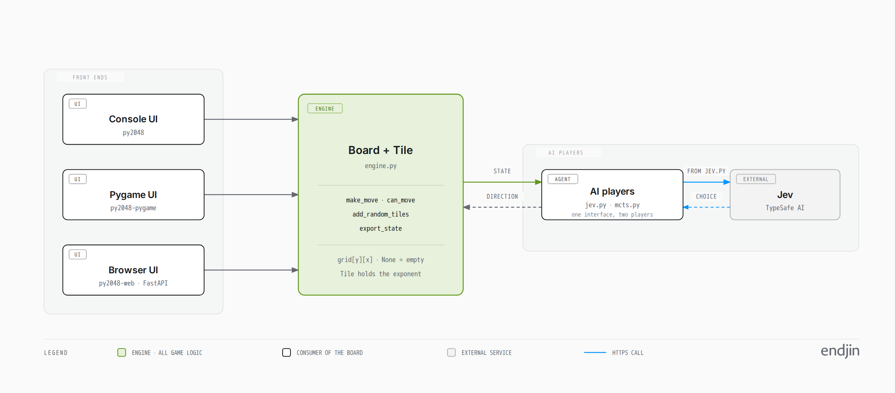
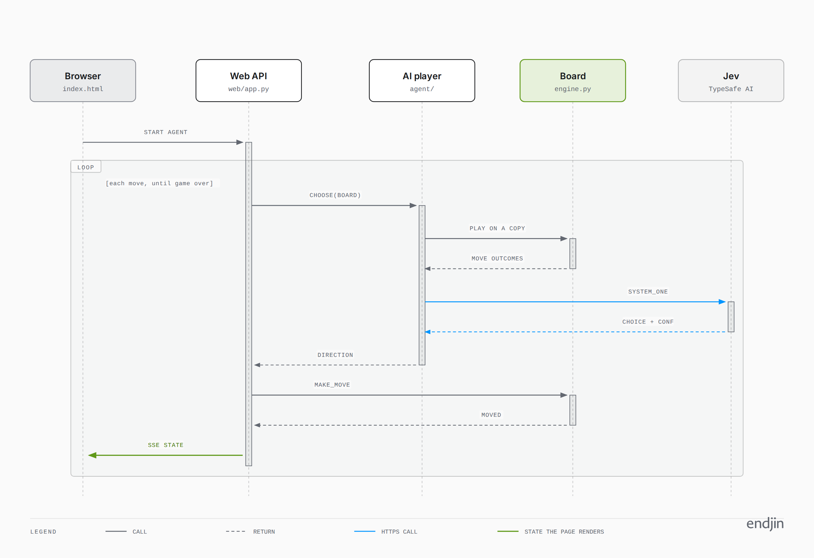
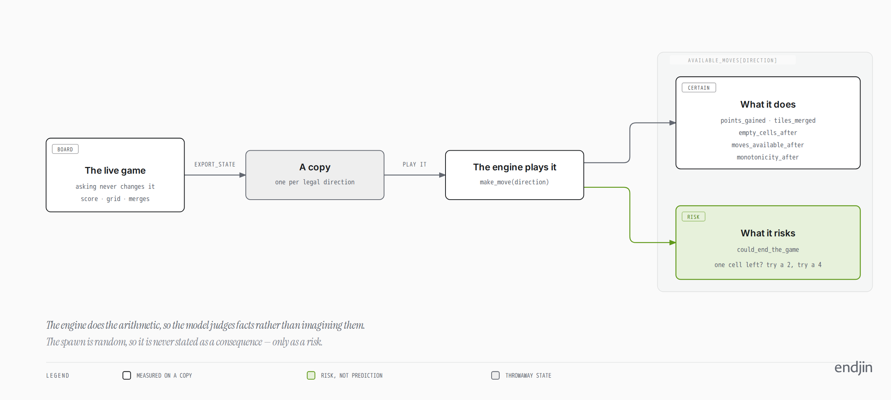
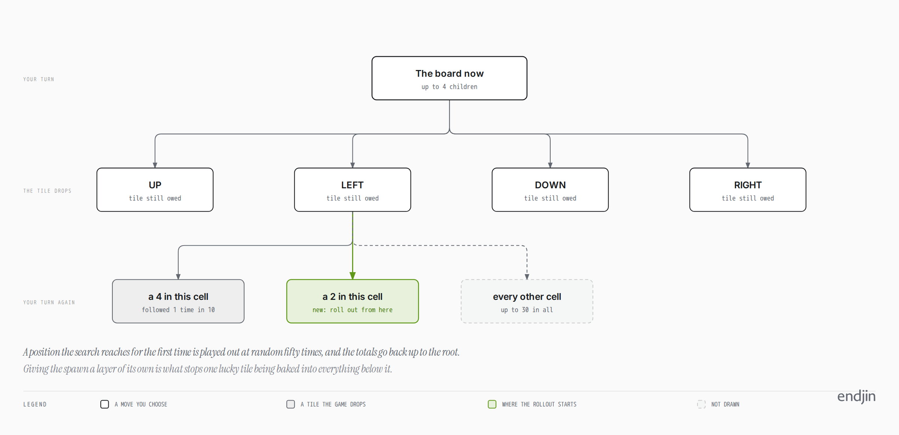

# Architecture

py2048 is a 2048 engine with three user interfaces and an AI player, built so the engine
can eventually sit under a search algorithm — A\*, BFS, Monte Carlo Tree Search — instead
of a keyboard.

This document is the one place the design is written down. The README says how to run it;
`CLAUDE.md` records the working rules for changing it.

---

## One engine, four consumers



```
src/py2048/engine.py      Board + Tile. The engine: all game logic.
src/py2048/console.py     Console UI.    Entry point: py2048
src/py2048/pygame_ui.py   Pygame UI.     Entry point: py2048-pygame
src/py2048/web/           Browser UI.    Entry point: py2048-web
src/py2048/agent/         AI players.    Board state in, one direction out
```

Every front-end is an independent consumer of one `Board`, and none reaches into another.
That split is the load-bearing decision in the repository: it is what lets the engine be
driven by a search algorithm rather than a person, and it is why the browser UI can hold
no game logic at all.

The engine's public surface is the package itself:

```python
from py2048 import Board

board = Board()
board.add_random_tiles(2)
board.make_move("LEFT")     # True if the board changed
board.can_move()            # False once the game is over
board.export_state()        # the grid as a list of lists, for rollouts
```

`export_state` and the `initial_state` constructor argument are the rollout pair: they let
any consumer copy a position, play it out, and throw the copy away. The AI player is built
entirely on them.

### Two conventions worth knowing before reading the code

- **Board state is `grid[y][x]`** — row first, then column — with `None` for an empty cell.
  Both the pygame UI and the browser UI index it the same way round; there is no transpose
  anywhere, and `features/rendering.feature` exists to keep it that way.
- **Tiles store the exponent.** `Tile(1)` renders as 2 and `Tile(3)` as 8. `get_value()`
  returns the exponent, `get_tile_value()` returns `2 ** exponent`. State crosses the wire
  to the browser and to the model as tile **values**, never exponents.

---

## The browser round trip

The browser UI keeps the engine authoritative. The page captures a key, posts it, and
renders whatever comes back; no rule is implemented twice.

State reaches the browser two ways: a snapshot at `GET /api/state`, and a push over
server-sent events at `GET /api/events`. The board only changes when the engine says so,
which is the shape SSE fits — and because every change broadcasts to all subscribers, two
open tabs stay in step and a search driving the same session needs no extra machinery.

| Endpoint | Does |
|---|---|
| `GET /api/state` | The current state, as tile values |
| `POST /api/move` | Play one direction; returns whether the board changed |
| `POST /api/new` | Start again. An AI player already playing keeps going |
| `POST /api/agent/start` · `/stop` | Hand the game to the AI player, or take it back |
| `GET /api/events` | The state stream, with a heartbeat every 15s |

When the AI player is driving, one move looks like this:



`AgentRunner` holds the loop and knows nothing about HTTP: it asks a player for a move,
applies it through the session, and waits. Because every move goes through the session,
the browser sees the AI's moves over the stream it is already listening to.

---

## Four AI players, one interface

A player is anything with `choose(board, moves_played, recent_moves)` that answers with a
direction and a decision, plus a `close()`. There is no base class to inherit. There are
four, and the browser picks between them:

| Player | Decides by | Needs |
|---|---|---|
| `jev` | Asking [TypeSafe AI's Jev][jev] to choose between the legal moves | `TYPESAFE_API_KEY`, or it falls back to `rules` |
| `mcts` | Searching the game tree locally, thousands of rollouts a move | Nothing but CPU |
| `rules` | Pushing into the top-right corner: UP, then RIGHT, then whatever is left | Nothing |
| `random` | Picking uniformly from the legal moves | Nothing |

They are deliberately separate. Between them they share the contract and the board
primitives, and nothing else:

```
agent/__init__.py        the register: which players there are, and in what order
agent/contract.py        what a player is: choose(), close(), decision()
agent/board.py           legal moves, copies — the primitives any player needs
agent/runner.py          the loop, and which player has the game

agent/jev/               player.py asks the model, state.py builds what it is told,
                         transcript.py prints what crossed the wire
agent/mcts/              player.py wears the contract, search.py is the algorithm
agent/rules_player.py    the corner policy
agent/random_player.py   the floor everything else is measured against
```

An agent gets a folder when it needs more than one module and a `*_player.py` when it does
not. The file that meets the contract is always the player; `contract.py` is the thing it
meets, which is why that one is not called `player.py` as well.

**Adding a fifth** is a module of your own — or a folder, if it needs more than one — and
one line in `default_players()`. Nothing else knows the names: the API, the runner and the
browser menu all read the register.

Three rules hold for all of them. **The engine stays authoritative** — a player only ever
names a direction, and the engine decides what that does. **Only legal moves are offered or
returned.** And **a fallback is never silent**: whatever the reason, it is carried on the
decision and shown on screen. `features/players.feature` runs all four against the same
boards to check exactly that, which is the test a fifth player would have to pass.

`AgentRunner` holds the players and which one has the game. It refuses a name it does not
know rather than falling back to another, because a typo that quietly started a different
player would look exactly like the one you asked for playing badly.

Every decision has the same shape (`agent/contract.py`), which is why the browser can draw
one player's answer with another's widget:

```python
{"move": "LEFT", "source": "mcts", "reason": None,
 "detail": "7660 rollouts over 1001 nodes, 16 deep",
 "probabilities": {"UP": 0.99, ...}, "confidence": 0.99,
 "risk": 1.71, "latencyMs": 301}
```

`reason` is for a fallback and reads as one on screen. `detail` is what a player wants to
say about a decision it did make — how hard the search looked, which rule was followed.

A player that has no distribution to report leaves `probabilities` out rather than
inventing one: the rules player always answers the same way, so a bar chart of its
"confidence" would say nothing. The random player does report one, because a uniform choice
over the legal moves is genuinely its distribution.

## The two simple players

`rules` plays the first direction on a fixed list that the engine will accept — UP, then
RIGHT, then DOWN, then LEFT — so tiles pile into the top-right corner and the list is only
broken when there is no choice. It is the oldest advice in 2048 and it plays a respectable
game, because the two directions that hold a corner also keep the big tiles adjacent, which
is what keeps merges lining up. It fails the way every fixed policy fails: once the
preferred pair is exhausted it has to break its own structure and has no way to choose
which break hurts least. The corner is a parameter — `BOTTOM_LEFT` is the mirror image.

This is also **what Jev falls back to** when there is no key, the API errors, or the model
cannot separate the options. The fallback used to be a tuple buried in the client; now it
has a name, a corner and scenarios of its own.

`random` picks uniformly from the legal moves. It is worth having as the floor every other
player is measured against — a search that cannot beat random is not searching — and as the
smallest thing that meets the contract, which makes it the one to copy when adding a fifth
player.

### The ladder they make

| Player | Median score | Best tile | Games |
|---|---|---|---|
| `random` | 580 | 128 | 5 |
| `rules` | 2,808 | 256 | 5 |
| `mcts` | ~27,000 | 2048 | 2 |

Small samples on fixed seeds, and the search ran at a tenth of its tuned thinking time, so
read these as an ordering rather than as measurements. The ordering is the point: each step
up costs something — a rule, then a great deal of CPU — and the gaps say what it bought.
`jev` is not in the table because benchmarking it means spending real API calls on a
thousand-move game.

The assignment's own numbers, at the tuned settings over 25 games, were 31,127 average for
games that reached 2048, with 72% reaching it.

## What Jev is told

`jev/state.py` builds the JSON state; `jev/player.py` asks Jev for a `Choice` between the
legal directions. No key, an API error, or a confidence below the threshold falls back to a
local policy and says so on screen.

The design principle is that the engine does the arithmetic and the model does the judging.
Every figure below is measured by copying the board and playing the move on the copy, so
the facts cannot drift from the rules:



### `board` — what is true right now

| Field | Says |
|---|---|
| `grid` | The board as tile values, `grid[row][column]`, `null` for empty |
| `score` | The running score |
| `empty_cells` | How much room is left |
| `largest_tile`, `largest_tile_cell` | The biggest tile and where it sits |
| `largest_tile_in_corner` | Whether it is anchored |
| `merges_available` | Adjacent equal pairs on the board now |
| `monotonicity` | 0–1: how well the tiles step down from the corner nearest the largest tile |

`monotonicity` is the heuristic every strong 2048 player uses, stated as a number. 1.0 is a
clean staircase, which is what keeps merges lining up. It is measured from whichever corner
the game is already built into, because which corner that is is the game's own business.

### `history` — what has been happening

| Field | Says |
|---|---|
| `moves_played` | How long this game has run |
| `recent_moves` | The last six directions played, oldest first |

Each call is otherwise stateless. Without `recent_moves`, a game ping-ponging LEFT and
RIGHT looks exactly like any other position.

### `available_moves[direction]` — what each move would do

Only directions the engine would accept appear here. Everything is the position the move
produces, *before* the random tile that spawns after it.

| Field | Says |
|---|---|
| `points_gained`, `tiles_merged` | What the move scores |
| `empty_cells_after`, `empty_cells_gained` | The room it leaves, and the change |
| `largest_tile_stays_in_corner` | Whether it keeps the big tile anchored |
| `moves_available_after` | The directions still legal afterwards |
| `merges_available_after` | The merges it sets up for the turn after |
| `monotonicity_after`, `monotonicity_change` | What it does to the ordering |
| `could_end_the_game` | Whether a spawn on the resulting board could leave no move |
| `board_after` | The resulting grid, as tile values |

`moves_available_after` and `could_end_the_game` are the two that carry danger. Without
them, a move that leaves one legal direction is indistinguishable from one that leaves
three.

### Certainty and risk are kept apart

Everything above but `could_end_the_game` is certain — it is the position the engine would
produce. The spawn is random, so it is never stated as a consequence of choosing a
direction.

`could_end_the_game` is the one exception, and it is deliberately framed as risk rather
than prediction: it says the position after this move *has* a spawn that leaves no legal
move, not that the spawn will happen. It is cheap to answer, because a spawn fills one cell
and a board with a free cell always has a move — so only a board with exactly one free cell
can be dead after a spawn, which takes two probes to check.

### The criteria carry the same facts

The `Choice` criterion is the text the decision is actually made against, so it restates
the JSON rather than summarising it:

```
Move DOWN:  merges nothing, leaves 4 empty cells, keeps the largest tile in a corner,
            leaves 3 legal direction(s), sets up 1 mergeable pair(s),
            tile ordering 0.75 (-0.21).
Move RIGHT: merges nothing, leaves 4 empty cells, keeps the largest tile in a corner,
            leaves 3 legal direction(s), sets up 3 mergeable pair(s),
            tile ordering 0.88 (-0.08).
```

Both leave the same room and both keep the big tile anchored. Only the last two clauses
separate them.

### Reading the exchange

`py2048-web` prints every exchange with Jev to standard out as JSON: the whole state that
went, the questions it was asked, the answer that came back, and what the player did with
it.

```
$ uv run py2048-web
{
  "at": "2026-09-18T10:27:46.209977+00:00",
  "move_number": 214,
  "sent": {
    "state": { "board": { "grid": [[128, 64, 16, 4], ...
    "questions": { "move": { "type": "Choice", "instructions": ..., "criteria": {...} }, ... }
  },
  "received": { "choice": "RIGHT", "confidence": 0.71, "probabilities": {...}, "risk": 0.9 },
  "latency_ms": 248,
  "outcome": "played RIGHT"
}
```

Two things make this worth having. The state is built from the board by code that can be
wrong, and a payload subtly misdescribing the position looks exactly like a model playing
badly. And the answer is the only evidence of *why* a move was played — the browser shows a
summary, this shows all of it.

A record is written even when Jev was not asked, so silence is never ambiguous:
`"outcome": "not asked: only one legal move"`, or `"not asked: no TYPESAFE_API_KEY set"`. A
call that failed carries an `error`.

Standard out belongs to the transcript, and uvicorn's access log is moved to standard
error, so it pipes:

```bash
uv run py2048-web 2>/dev/null | jq -c '{move: .move_number, outcome, choice: .received.choice}'
uv run py2048-web 2>/dev/null | jq 'select(.outcome | startswith("fell back"))'
```

The records are pretty-printed but each is one JSON value, and `jq` reads a stream of them.
Arrays of plain values stay on one line, so a board reads as four rows rather than
twenty-four lines of digits.

**It is off unless something asks for it.** `agent/jev/transcript.py` logs to `py2048.jev`,
which has a null handler and does not propagate — so in the specifications, or in anything
embedding the app, the record is never even built. `transcript.log_to_stdout()` turns it
on and `transcript.silence()` turns it off again.

The key is never in it. It appears in no part of the state, the questions or the answer,
and nothing in that module reads the environment — `ai_player.feature` has a scenario that
stubs a key and checks it does not turn up.

### What is deliberately left out

- **The spawn itself.** Naming a cell the tile "will" appear in would be a guess presented
  as a fact.
- **The whole move transcript.** Six moves is enough to show a game going in circles; more
  is a transcript to read rather than a position to judge.
- **A recommendation.** Which move is best is the question being asked, not part of the
  state.
- **Deeper rollouts.** One ply is measured. Two would multiply the payload and start
  guessing at spawns, which is search — and search belongs in the engine (issue #6), not in
  the prompt.

---

## How the search plays

`mcts/search.py` is a port of [Applying MCTS to 2048][mcts-repo], an MSc assignment that
tuned these parameters over several hundred games and reached 2048 or better in 72% of its
final runs. The algorithm and its numbers are that work's; what changed is that it runs on
this engine, inside the player interface above.

It needs no key and no network. Given half a second it plays about 7,000 random games from
the current position and plays the move it spent most of that time on.



### The tree alternates between two kinds of turn

A **MOVE** node is a position the player acts from, and has at most four children. A
**SPAWN** node is the board after a move, waiting for the random tile, and has one child
per empty cell per tile value — up to thirty.

Giving the spawn a layer of its own is the expensive decision in the design, and the
deliberate one. The alternative is to sample one tile and let the whole branch below it
assume that drop happened, which bakes a lucky 4 into everything underneath.

Traversal follows a spawn child at the rate the game actually drops it — nine times in ten
for a 2 — rather than by UCB1. Without that the search spends its time in the branches
where a 4 appeared, because those score better.

### The four phases, as implemented

| Phase | Where |
|---|---|
| Select | `_descend` walks down by UCB1 from the root |
| Expand | `Node.expand` builds every child, the first time a node is revisited |
| Roll out | `Node.rollout` plays 50 random games, each capped at 12 moves |
| Back up | `Node.backpropagate` adds the totals to every ancestor |

Reward is the **score at the end of a rollout**, not the points the rollout scored. A
node's rollouts start from the score the game has already reached, so a move that merges
carries its own points into every rollout below it. The part common to all siblings cancels
when they are compared; what is left is credit for merging.

### The settings, and where they came from

| Setting | Default | Why |
|---|---|---|
| `thinking_time` | 0.5s | The report found the elbow of the curve at about 0.25s and settled on 0.5. The single most effective thing to raise. |
| `exploration` | 20 | The C in UCB1. Large because exploitation is a raw 2048 score, not a win rate in [0, 1]. |
| `rollout_depth` | 12 | Beyond about four the report found little gain for the time. |
| `rollouts_per_node` | 50 | The report put the useful range at 50–100. |
| `reward` | `score` | The merge count was explored on the theory that scoring makes the search greedy; the score won. |
| `reset_reward_on_rollout` | `False` | Carries the banked score into each rollout — see above. |
| `sample_spawn` | `True` | Follow the spawn the game would actually drop. |

The exploration constant is the honest loose end. The report is candid that it never found
a principled value, and scaling it with the board is the obvious thing still to try.

### What it reports

`probabilities` are visit shares across the root's children, and the move played is the
most visited one — not the best UCB1, which carries an exploration bonus that belongs in
the traversal rather than in the answer.

`confidence` is the winning move's share of the search, which is **not** the same quantity
as Jev's confidence and is routinely 0.9 or higher. A search that has settled is not a
search that is calibrated. `detail` carries the rollout, node and depth counts, which are
the numbers worth watching.

`risk` is worked out locally from the room left on the board, so that the browser's risk
line means roughly the same thing whichever player is on.

### It runs in a thread

The search is CPU-bound and takes about as long as it is given. On the event loop it would
stall the event stream every single move, so `MctsPlayer.choose` hands it to
`asyncio.to_thread`. Nothing in `mcts/search.py` is async or touches I/O, which is what makes that
safe.

### What changed in the port

Four fixes, none of them cosmetic:

- **A terminal node no longer ends the search.** The original aborted the whole traversal
  when it met a dead position anywhere in the tree and reported "no move", which ended
  games that were not over. A terminal node is a branch with no future, so it is scored
  where it stands and left to be out-competed.
- **The spawn probability follows the engine.** Traversal was hard-coded to 80/20, from the
  older engine that bundled with it. The engine spawns a 4 one time in ten, and the report
  itself describes 90/10.
- **The engine copy is gone.** The player uses `py2048.Board` like every other consumer, so
  the specifications cover the rules it searches.
- **pandas is gone**, along with the global node counter. pandas was pulled in to call
  `describe()` on a handful of numbers.

Weighted random rollout moves were dropped: the setting was off in the final configuration
and the report presents no results for it. It is a few lines to restore if it is wanted.

`flat_search` is kept. The assignment called it "level 1 simulation" and used it to tune
rollout depth and count in isolation from the tree, and it is a reasonable fast player in
its own right.

### How well it plays

Two games at a tenth of the tuned thinking time (0.1s, 20 rollouts, depth 8) reached 2048
with scores of 27,332 and 27,168 over about 1,400 moves each. That is in line with the
report's 31,127 average for games that reached 2048, which is the result the port was
checked against.

---

## Where this is pinned down

`features/` is the safety net for everything that changes the engine, and the reason the
board representation can be optimised without changing behaviour.

| Feature file | Pins down |
|---|---|
| `movement.feature`, `symmetry.feature` | Merge and slide rules, in all four directions |
| `no_op_moves.feature` | A move that changes nothing is refused |
| `spawning.feature` | Where and how often tiles appear |
| `game_over.feature` | When there is no move left |
| `rendering.feature` | That the pygame UI draws the board the right way round |
| `pygame_controls.feature` | Keys, restart, quit |
| `web_api.feature` | The endpoints and the event stream |
| `players.feature` | The contract all four meet, run against each of them in turn |
| `ai_player.feature` | The state we send Jev, legal-moves-only, visible fallbacks, and the transcript |
| `mcts_player.feature` | That the search stays legal, leaves the board alone and respects its clock |
| `simple_players.feature` | The corner rules, and that random stays legal and spreads out |

Scenarios speak in tile values, and a board is four rows with no header row — behave reads
the first row as headings and `grid_from_table` puts it back. Rules that hold in all four
directions are written once with the line notation, and randomness is seeded per scenario
so a replay can be asserted instead of a hard-coded spawn coordinate.

No specification calls the live model, and every scenario that runs the search runs it with
a fraction of its normal time. How well a player plays is a question for a benchmark, not
for a specification: a stronger search would pass every scenario in `mcts_player.feature`,
and so would a weaker one.

---

## The diagrams

The four diagrams above are generated, not drawn. Each is a self-contained HTML file in
[`diagrams/`](diagrams/) — that is the source — and the committed `.png` beside it is the
export used in this document.

| Diagram | Shows |
|---|---|
| `architecture-overview` | The engine and its four consumers |
| `ai-move-sequence` | One AI move: browser → runner → Jev → engine → SSE |
| `state-provenance` | How each fact in Jev's payload is measured, and which one is risk |
| `mcts-tree` | The search tree's alternating move and spawn layers |

They use endjin's web palette, stored as a Diagram Design profile. The project's
`.diagram-design` marker binds the repository to it, so a new diagram picks up the same
skin without being told:

```
~/.diagram-design/profiles/endjin.md   the profile
.diagram-design                        profile: endjin
```

The profile lives outside the repository, so a fresh machine will not have it. It was
generated by reading the custom properties out of endjin.com's stylesheet, and can be
regenerated the same way; the tokens themselves are recorded in the profile's header.

To change a diagram, edit its HTML and re-export it to PNG at 2× with a headless browser.
The browser UI and the pygame UI use the same palette, so the screenshots and the diagrams
agree.

[jev]: https://docs.typesafe.ai/introduction
[mcts-repo]: https://github.com/Smartitect/Applying-MCTS-To-2048
